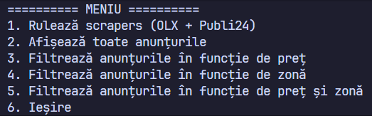
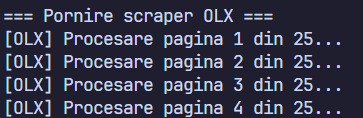

# 🏙️ RentScraper-Brasov  
Scraper pentru extragerea ofertelor de închiriere din Brașov de pe **OLX** și **Publi24**, cu procesare, filtrare și export în Excel.  
Proiect creat pentru o gestionare și accesare mai ușoară a ofertelor de chirie din Brasșov.

---

## 🚀 Funcționalități principale

### 🔹 1. Scraping automat (OLX + Publi24)
- extrage titlu, preț, monedă, zonă și link  
- detectează zonele automat  
- convertește prețurile din **EUR → RON** (cu API Forex)  
- evită duplicatele prin `INSERT OR IGNORE`

---

### 🔹 2. Interfață CLI intuitivă
Meniul principal:



---

### 🔹 3. Filtrarea datelor
- filtrare după preț  
- filtrare după zonă  
- filtrare combinată preț + zonă  
- afișare în tabel  
- export în Excel

---

### 🔹 4. Afișare progres scraping (Live)


Programul arată în timp real progresul paginilor procesate pentru fiecare platformă.

---

### 🔹 5. Export complet în Excel
Datele colectate sunt salvate în **BazaDate.db**, iar la cerere pot fi exportate:


---

## 📦 Instalare

### 1. Clonează repository-ul:
```bash
git clone https://github.com/ciufuu/RentScraper-Brasov.git
cd RentScraper-Brasov
```

### 2. Instalează dependențele:
```bash
pip install requests beautifulsoup4 pandas
```
## ▶️ Rulare

Pentru a porni aplicația, rulează scriptul principal în terminal:

```bash
python scraper.py
```

După lansare, vei vedea meniul interactiv:

```
=========== MENIU ===========
1. Rulează scrapers (OLX + Publi24)
2. Afișează toate anunțurile
3. Filtrează anunțurile în funcție de preț
4. Filtrează anunțurile în funcție de zonă
5. Filtrează anunțurile în funcție de preț și zonă
6. Ieșire
```

---

🙌 Dacă aplicația te ajută și vrei să susții proiectul, poți lăsa o **stea ⭐**  


